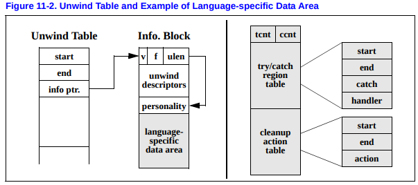

# Detail of Unwind Table and LSDA

The unwind table entries contain three fields, as illustrated in [Figure 11-2](https://www.intel.com/content/dam/www/public/us/en/documents/guides/itanium-software-runtime-architecture-guide.pdf); each field is a 64-bit doubleword. The first two fields define the starting and ending addresses of the procedure, respectively, and the third field points to a variable-size information block containing the unwind descriptor list and language-specific data area. The ending address is the address of the first bundle beyond the end of the procedure. These values are all segment-relative offsets, not absolute addresses, so they do not require run-time relocations. The unwind table is sorted by the procedure start address. The shaded area in the figure represents the LSDA(language-specific data area). 

Detailed information:

https://www.intel.com/content/dam/www/public/us/en/documents/guides/itanium-software-runtime-architecture-guide.pdf