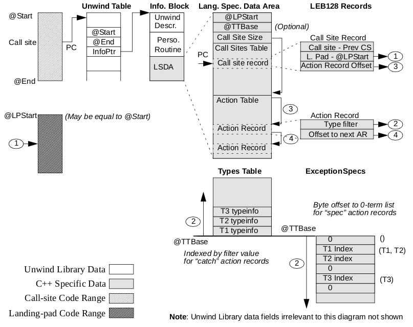

# Do you make sense of 'Exception tables' and  'Unwind tables"?

​	Exception tables are necessary to handle exceptions thrown by functions in high-level languages such as C++.

​	Unwind tables contain debug frame information which is also necessary for the handling of such exceptions. An exception can only propagate through a function with a unwind table. You use [`FRAME directives`](http://www.keil.com/support/man/docs/armasm/armasm_dom1359731156706.htm) to enable the assembler to generate unwind tables.

​	An assembly language function is code enclosed by either `PROC` and `ENDP` or `FUNC` and `ENDFUNC` directives. Functions written in C++ have unwind information by default. However, for assembly language functions that are called from C++ code, you must ensure that there are exception tables and unwind tables to enable the exceptions to propagate through them.

​	An exception can not propagate through a function with a no-unwind table. The exception handling runtime environment terminates the program if it encounters a no-unwind table during exception processing.

​	The assembler can generate no-unwind table entries for all functions and non-functions. The assembler can generate an unwind table for a function only if the function contains sufficient `FRAME` directives to describe the use of the stack within the function. To be able to create an unwind table for a function, each `POP` or `PUSH` instruction must be followed by a [`FRAME POP`](http://www.keil.com/support/man/docs/armasm/armasm_dom1361290010463.htm) or [`FRAME PUSH`](http://www.keil.com/support/man/docs/armasm/armasm_dom1361290010793.htm) directive respectively. Functions must conform to the conditions set out in the [Exception Handling ABI for the ARM Architecture(EHABI)](http://infocenter.arm.com/help/topic/com.arm.doc.ihi0038-/index.html), section 9.1 `Constraints on Use`. If the assembler can not generate an unwind table it generates a no-unwind table.

## Overview of exception handling

​	The process of finding excepting handling information from the current PC is summarized in the diagram below:

​	All tables are in "text" space. The types pointed by the typeinfo pointers are identified by a GP-relative offset.

​	Note:

​	For more detailed information, see:

https://itanium-cxx-abi.github.io/cxx-abi/exceptions.pdf

https://itanium-cxx-abi.github.io/cxx-abi/abi-eh.html#base-data

## Related Information:

###### [1.1 Exception Handler Framework](https://itanium-cxx-abi.github.io/cxx-abi/abi-eh.html#base-framework)