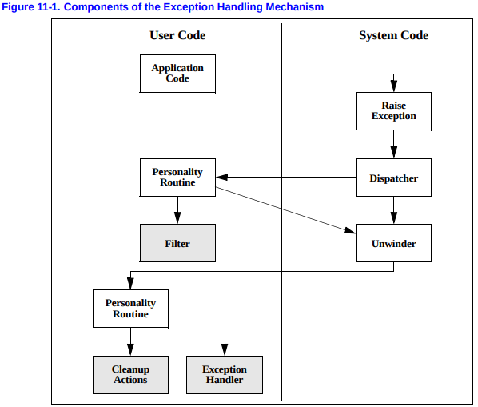

##### The Unwind Process

​	The standard ABI exception handling / unwind process begins with the raising of an exception, in one of the forms mentioned above. This call specifies an exception object and an exception class.

​	The runtime framework then starts a two-phase process:

- In the search phase, the framework repeatedly calls the personality routine, with the `_UA_SEARCH_PHASE` flag as described below, first for the current PC and register state, and then unwinding a frame to a new PC at each step, until the personality routine reports either success(a handler found in the queried frame) or failure(no handler) in all frames. It does not actually restore the unwound state, and the personality routine must access the state through the API.

- If the search phase report failure, e.g. because no handler was found, it will call terminate() rather than commence phase 2.

  If the search phase reports success, the framework restarts in the cleanup phase. Again, it repeatedly calls the personality routine, with the `_UA_CLEANUP_PHASE` flag as described below, first for the current PC and register state, and then unwinding a frame to a new PC at each step, until it gets to the frame with an identified handler. At that point, it restores the register state, and control is transferred to the user landing pad code.

​	Each of these two phases uses both the unwind library and the personality routines, since the validity of a given handler and the mechanism for transferring control to it are language-dependent, but the method of locating and restoring previous stack frames is language independent.

​	A two-phase exception-handling model is not strictly necessary to implement C++ language semantics, but it does provide some benefits. For example, the first phase allows an exception-handling mechanism to dismiss an exception before stack unwinding begins, which allows resumptive exception handling(correcting the exceptional condition and resuming excution at the point where it was raised). While C++ does not support resumptive exception handling, other languages do, and the two-phase model allows C++ to coexist with those language on the stack.

​	Note that even with a two-phase model, we may execute each of the two phase more than once for a single exception, as if the exception was being thrown more than once. For instance, since it is not possible to determine if a given catch will rethrow or not without executing it, the exception propagation effectively stops at each catch clause, and if it needs to restart, restarts at phase 1. This process is not needed for destructors(cleanup code), so the phase 1 can safely process all destructor-only frames at once and stop at the next enclosing catch clause.

​	For example, if the first two frames unwound contain only cleanup code, and the third frame contains a C++ catch clause, the personality routine in phase 1 does not indicate that it found a handler for the first two frames. It must do so for the third frame, because it is unknown how the exception will propagate out of this third frame, e.g. by rethrowing the exception or throwing a new one in C++.

​	The API specified by the Itanium psABI for implementing this framework is described in the page, see:https://itanium-cxx-abi.github.io/cxx-abi/abi-eh.html#base-data

## Mechanism Diagram

Detail information:

https://itanium-cxx-abi.github.io/cxx-abi/abi-eh.html#base-data

https://www.intel.com/content/dam/www/public/us/en/documents/guides/itanium-software-runtime-architecture-guide.pdf

