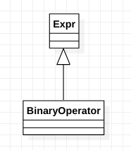

# class clang::BinaryOperator

​	A builtin binary operation expression such as "x + y" or "x <= y".

​	This expression node kind describes a builtin binary operation, such as "x + y" for integer values "x" and "y". The operands will already have been converted to appropriate types (e.g., by performing promotions or conversions).

​	In C++, where operators may be overloaded, a different kind of expression node (CXXOperatorCallExpr) is used to express the invocation of an overloaded operator with operator syntax. Within a C++ template, whether BinaryOperator or CXXOperatorCallExpr is used to store an expression "x + y" depends on the subexpressions for x and y. If neither x or y is type-dependent, and the "+" operator resolves to a builtin operation, BinaryOperator will be used to express the computation (x and y may still be value-dependent). If either x or y is type-dependent, or if the "+" resolves to an overloaded operator, CXXOperatorCallExpr will be used to express the computation.

Inheritance diagram for class clang::BinaryOperator:

