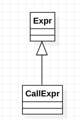

# class clang::CallExpr

​	CallExpr - Represents a function call (C99 6.5.2.2, C++ [expr.call]).

​	CallExpr itself represents a normal function call, e.g., "f(x, 2)", while its subclass may represent alternative syntax that (semantically) result in a function call. For example, CXXOperatorCallExpr is a subclass for overloaded operator calls that use operator syntax, e.g., "str1 + str2" to resolve to a funcation call.

Inheritance diagram for class clang::CallExpr:

