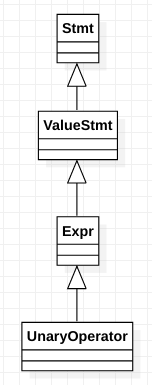

# class clang::UnaryOperator

​	This represents the unary-expression's (except sizeof and alignof), the postinc/postdec operators from postfix-expression, and various extensions.

​	Nots on varous nodes:

​	Real/Imag - These return the real/imag part of a complex operand. If applied to a non-complex value, the former returns its operand and the later returns zero in the type of the operand.

Inheritance diagram for class clang::UnaryOperator:

