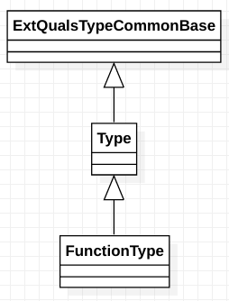

# class clang::FunctionType

​	FunctionType - C99 6.7.5.3 - Function Declarators. This is the common base class of FunctionNoProtoType and FunctionProtoType

Inheritance diagram for class clang::FunctionType:

