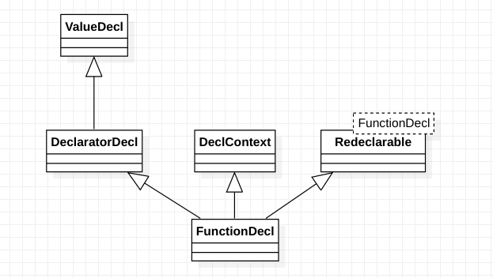

# class clang::FunctionDecl

Represents a function declaration or definition.

Since a given function can be declared several times in a program, there may be several FunctionDecls that correspond to that function. Only one of those FunctionDecls will be found when traversing the list of declarations in the context of the FunctionDecl (e.g., the translation unit); this FunctionDecl contains all of the information known about the function. Other, previous declarations of the function are available via the getPreviousDecl() chain.

Inheritance diagram for class clang::FunctionDecl:

