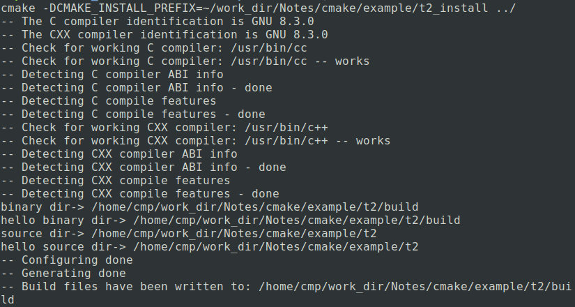
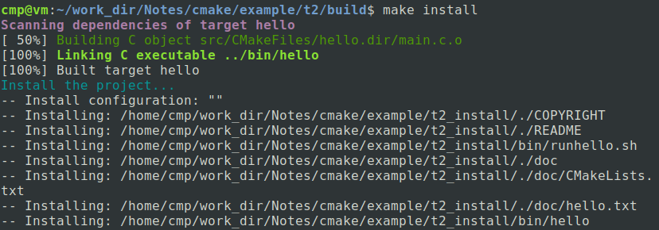

# How to install with cmake

## Install:

​	Specify rules to run at install time.

### 	Synopsis:

```cmake
install(TARGETS <target>... [EXPORT <export-name>]
[
[ARCHIVE|LIBRARY|RUNTIME|OBJECTS|FRAMEWORK|BUNDLE|
	PRIVATE_HEADER|PUBLIC_HEADER|RESOURCE]
[DESTINATION <dir>]
[PERMISSIONS permissions...]
[CONFIGURATIONS [Debug|Release|...]]
[COMPONENT <component>]
[NAMELINK_COMPONENT <component>]
[OPTIONAL]
[EXCLUDE_FROM_ALL]
[NAMELINK_ONLY|NAMELINK_SKIP]
][...]
[INCLUDES DESTINATION [<dir> ...]]
)
install({FILES | PROGRAMS} <file>... [...])
install(DIRECTORY <dir>... [...])
install(SCRIPT <file> [...])
install(CODE <code> [...])
install(EXPORT <export-name> [...])
```


​	This command generates installation rules for a project. Rules specified by calls to this command within a source directory are executed in order during installation. The order across directories is not defined.

### 	The common options are:

#### 		DESTINATION:

​		Specify the directory on disk to which a file will be installed. If a full path(with a leading slash or drive letter) is given it is used directly. If a relative path is given it is interpreted relative to the value of [CMAKE_INSTALL_PREFIX][https://cmake.org/cmake/help/v3.16/variable/CMAKE_INSTALL_PREFIX.html#variable:CMAKE_INSTALL_PREFIX] variable.

#### 	PERMISSIONS:

​		Specify permissions for installed files. Valid permissions are OWNER_PREAD, OWNER_WRITE, OWNER_EXECUTE, GROUP_READ, GROUP_WRITE, GROUP_EXECUTE, WORLD_READ, WORLD_WRITE, WORLD_EXECUTE, SETUID, and SETGID. 

#### 	CONFIGURATIONS:

​		Specify a list of build configurations for which the install rule applies(Debug, Release, etc.). Note that the values specified for this option only apply to options listed AFTER the CONFIGURATIONS option. For example, to set separate install paths for the Debug and Release configurations, do the following:

```cmake
install(TARGETS target
		CONFIGURATIONS Debug
		RUNTIME DESTINATION Debug/bin)
install(TARGETS target
		CONFIGURATIONS Release
		RUNTIME DESTINATION Release/bin)
```

#### 	COMPONENT:

​		Specify an installation component name with which the install rule is associated, such as "runtime" or "development". During component specific installation only install rules associated with the given component name will be executed. During a full installation all components are installed unless marked with EXCLUDE_FROM_ALL. If COMPONENT is not provided a default component "Unspecified" is created. The default component name may be controlled with the [CMAKE_INSTALL_DEFAULT_COMPONENT_NAME][https://cmake.org/cmake/help/v3.16/variable/CMAKE_INSTALL_DEFAULT_COMPONENT_NAME.html#variable:CMAKE_INSTALL_DEFAULT_COMPONENT_NAME] variable.

#### 	EXCLUDE_FROM_ALL:

// TODO

### Example:

Source-code directory tree

```
.
├── build
├── CMakeLists.txt
├── COPYRIGHT
├── doc
│   ├── CMakeLists.txt
│   └── hello.txt
├── README
├── runhello.sh
└── src
    ├── CMakeLists.txt
    └── main.c
```

./CMakeLists.txt:

```cmake
cmake_minimum_required(VERSION 3.12)
PROJECT(HELLO)
ADD_SUBDIRECTORY(src)
ADD_SUBDIRECTORY(doc)

#install
INSTALL(FILES COPYRIGHT README DESTINATION .)
INSTALL(PROGRAMS runhello.sh DESTINATION bin)
INSTALL(DIRECTORY doc DESTINATION .)

```

./src/CMakeLists.txt:

```cmake
ADD_EXECUTABLE(hello main.c)
MESSAGE("binary dir-> ${PROJECT_BINARY_DIR}")
MESSAGE("hello binary dir-> ${HELLO_BINARY_DIR}")
MESSAGE("source dir-> ${PROJECT_SOURCE_DIR}")
MESSAGE("hello source dir-> ${HELLO_SOURCE_DIR}")
SET(EXECUTABLE_OUTPUT_PATH ${PROJECT_BINARY_DIR}/bin)
INSTALL(TARGETS hello
    RUNTIME DESTINATION bin
    LIBRARY DESTINATION lib
    ARCHIVE DESTINATION libstatic
    )
```

./doc/CMakeLists.txt: This file is empty.

Then, Enter 'build' directory, and run command as follow:

```shell
cmake -DCMAKE_INSTALL_PREFIX=${USER_DEFINE_INSTALL_DIR} ../
```

Outputs:



Finally, run command:

```shell
make install
```

Outputs:



View the files in the ${USER_DEFINE_INSTALL_DIR} directory, as follow:

```
.
├── bin
│   ├── hello
│   └── runhello.sh
├── COPYRIGHT
├── doc
│   ├── CMakeLists.txt
│   └── hello.txt
└── README

```

