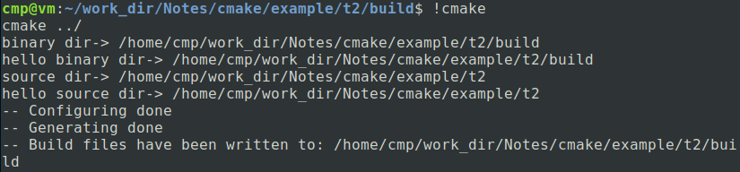

# Distinguish PROJECT_SOURCE_DIR and PROJECT_BINARY_DIR

## PROJECT_SOURCE_DIR:

​	Top level source directory for the current project. It is same as <PROJECT-NAME>_SOURCE_DIR.

## PROJECT_BINARY_DIR:

​	Full path to build dirrectory for project. It is same as <PROJECT-NAME>_BINARY_DIR.

### Example:

```
.
├── build
├── CMakeLists.txt
└── src
    ├── CMakeLists.txt
    └── main.c
```

./CMakeLists.txt:

```cmake
cmake_minimum_required(VERSION 3.12)
PROJECT(HELLO)
ADD_SUBDIRECTORY(src)
```


./src/CMakeLists.txt:

```cmake
ADD_EXECUTABLE(hello main.c)
MESSAGE("binary dir-> ${PROJECT_BINARY_DIR}")
MESSAGE("hello binary dir-> ${HELLO_BINARY_DIR}")
MESSAGE("source dir-> ${PROJECT_SOURCE_DIR}")
MESSAGE("hello source dir-> ${HELLO_SOURCE_DIR}")
SET(EXECUTABLE_OUTPUT_PATH ${PROJECT_BINARY_DIR}/bin)
```

./main.c

```c
#include <stdio.h>
int main(){
    printf("Hello world from t1 main!\n");
    return 0;
}
```

Enter the 'build' directory, and run command:

```shell
cmake ..
```

The outputs is as follow:

