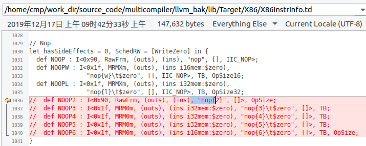

# Problem notes

- About llvm/include/llvm/Config folder, there are so mang difference between multicompiler and llvm9.0,  as below:

  

  so just do not deal with his problem for now.

- In llvm9.0, header file llvm/include/llvm/IR/TypeBuilder.h has been removed. 

- In llvm9.0, header file llvm/include/llvm/Target/TargetLowering.h has been removed.

- About llvm/lib/CodeGen/SelectionDAG/DAGCombiner.cpp, for now, i can not merge multicompiler3.8 to llvm9.0, beacuse they are completely different as llvm9.0 refactored.

  

- About the `CalcNodeSethiUllmanNumber` Function at file of llvm/lib/CodeGen/SelectionDAG/ScheduleDAGRRList.cpp, for now, I can not merge multicompiler3.8 to llvm9.0, beacuse the function has been refactored and there are so many difference.

  

- Have `void IntrinsicLowering::AddPrototypes(Module &M)` function in llvm/lib/CodeGen/IntrinsicLowering.cpp file been removed in llvm9.0? I can not merge multicompiler3.8 to llvm9.0, beacuse I do not find the function.

  

- Have `void MachineModuleInfo::EndFunction()` function in llvm/lib/CodeGen/MachineModuleInfo.cpp file been removed in llvm9.0? I can not merge multicompiler3.8 to llvm9.0, beacuse I do not find the function.

  

- As the Function `void MIPrinter::print(const MachineOperand &Op, const TargetRegisterInfo *TRI,unsigned I, bool ShouldPrintRegisterTies, bool IsDef)` has been refactored in llvm/lib/CodeGen/MIRPrinter.cpp file, there are so many differences between multicompiler3.8 and llvm9.0, for now I can not to merge.

  

- In llvm9.0, header file llvm/lib/CodeGen/Passes.cpp has been removed.

- As the function `void PEI::calculateFrameObjectOffsets` has been refactored in llvm/lib/CodeGen/PrologEpilogInserter.cpp file In llvm9.0, there are so many differences between multicompiler3.8 and llvm9.0, for now I can not to merge.

  

- As the function `uint64_t AttributeImpl::getAttrMask(Attribute::AttrKind Val)` in llvm/lib/IR/Attributes.cpp file has been removed, for now I can not to merge.

  

- As the function `ConstantInt::ConstantInt` in llvm/lib/IR/Constants.cpp file has been refactored , for now I can not to merge.

  

- In llvm9.0, header file llvm/lib/IR/ValueTypes.cpp has been removed.

- As the function `void Verifier::verifyAttributeTypes` has been refactored, for now I can not to merge.

  

- As the function `void IRLinker::materializeInitFor` in llvm/lib/Linker/IRMover.cpp file has been removed, for now I can not to merge.

  

- There are so many differences in llvm/lib/Target/X86/X86InstrInfo.td file, I can not merge.

  

- As the function `X86TargetLowering::LowerCall` in llvm/lib/Target/X86/X86ISelLowering.cpp file has been refactored, I can not merge.

  

- As the function `X86TargetLowering::LowerGlobalAddress` in llvm/lib/Target/X86/X86ISelLowering.cpp and llvm/lib/Target/X86/X86ISelLowering.h has been refactored, I can not merge.

  

- For now, I leave llvm/patches, llvm/projects, llvm/test alone without dealing.

  

- As `configure & make` was not deprecated, for now, I do not merge llvm/configure and llvm/Makefile.

- As llvm/tools/clang/lib/Basic/Targets.cpp has been refactored, I can not merge.

- As the function `EmitAssemblyHelper::CreateTargetMachine` in llvm/tools/clang/lib/CodeGen/BackendUtil.cpp file has been refactored, I can not merge.

  

- As the function `void CodeGenVTables::createVTableInitializer` in llvm/tools/clang/lib/CodeGen/CGVTables.cpp file has been refactored, I can not merge.

  

- As the function `CodeGenFunction::StartFunction` in llvm/tools/clang/lib/CodeGen/CodeGenFunction.cpp file has been refactored, I can not merge.

  

- As the `CodeGenModule::isInSanitizerBlacklist` function in llvm/tools/clang/lib/CodeGen/CodeGenModule.cpp file has been refactored, I can not merge.

  

- As the `hasAnyUsedVirtualInlineFunction` function in llvm/tools/clang/lib/CodeGen/ItaniumCXXABI.cpp file has been refactored, I can not merge.

  

- As the `ItaniumCXXABI::EmitLoadOfMemberFunctionPointer` Function in llvm/tools/clang/lib/CodeGen/ItaniumCXXABI.cpp file has been refactored, I can not merge.

  

- There so many differences in llvm/tools/clang/lib/CodeGen/ItaniumCXXABI.cpp, you would better merge it carefully.

- As the `MicrosoftCXXABI::emitVTableDefinitions` function in llvm/tools/clang/lib/CodeGen/MicrosoftCXXABI.cpp file has been refactored, I can not merge.

  

- As the `SanitizerArgs::clear` function be remove in llvm/tools/clang/lib/Driver/SanitizerArgs.cpp file has been removed, I can not merge.

  

- As the `getSupportedSanitizers` function in llvm/tools/clang/lib/Driver/ToolChains.cpp file as been refactored, I can not merge.

  

- The llvm/tools/clang/lib/Driver/Tools.cpp file has been removed.

- 

- 

- 

- 

- 

- 

- 

- 

  
