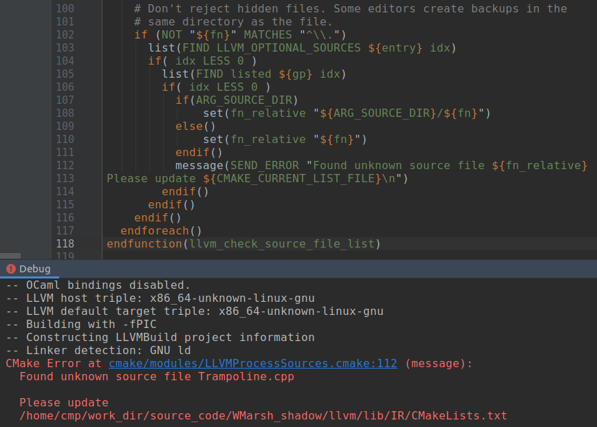

# CMake err "Found unknown source file"

​	LLVM don't reject hidden files. Some editors create backups in the same directory as the file.



​	The way to solve this problem is:

```cmake
100     # Don't reject hidden files. Some editors create backups in the
101     # same directory as the file.
102     if (NOT "${fn}" MATCHES "^\\.")
103       list(FIND LLVM_OPTIONAL_SOURCES ${entry} idx)
104       if( idx LESS 0 )
105         list(FIND listed ${gp} idx)
106         if( idx LESS 0 )
107           if(ARG_SOURCE_DIR)
108               set(fn_relative "${ARG_SOURCE_DIR}/${fn}")
109           else()
110               set(fn_relative "${fn}")
111           endif()
112 ---       message(SEND_ERROR "Found unknown source file ${fn_relative}
112 +++       message(WARNING "Found unknown source file ${fn_relative}
113 Please update ${CMAKE_CURRENT_LIST_FILE}\n")
114         endif()
115       endif()
116     endif()
117   endforeach()
118 endfunction(llvm_check_source_file_list)

```

Modifying `SEND_ERROR` to `WARNING`.