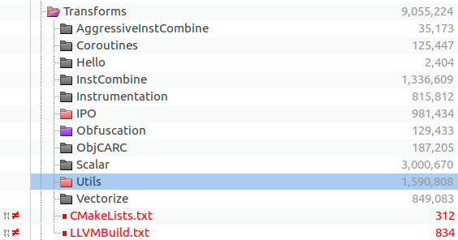

# Anatomy of the obfuscator-llvm

​	This article is intended for show the difference between llvm-9.0 and obfuscator-9.0, and analyze the mechanism of obfuscation with llvm infrastructure. So we will cover the following topics:

​	1. Diff llvm-9.0 and obfuscator-9.0

​	2. How obfuscator work with llvm infrastructure

​	3. Anatomy of the obfuscation algorithm

	4. What are the defects of obfuscator


## 	1. Diff llvm-9.0 and obfuscator-9.0

​	In this part, we will compare the source-code of them, and show which part of code is about obfuscator. So, the diff result as follow show:



​	As seen, the major differences is about `llvm/lib/Transforms` directory. Baseed on llvm infrastructure, obfuscator adds a new directory  named `Obfuscation` in which the files implement all the features of obfuscator. The features such as: Instruction Substitution, Bogus Control Flow, Control Flow Flattening, Functions annotations.

​	The file list of Obfuscator directory:

```
lib
├── ...
├── Transforms
│   ├── ...
│   ├── Obfuscation
│   │   ├── BogusControlFlow.cpp    # Bogus Control Flow
│   │   ├── CMakeLists.txt
│   │   ├── CryptoUtils.cpp
│   │   ├── Flattening.cpp          # Control Flow Flattening
│   │   ├── LICENSE-OBFUSCATOR.TXT
│   │   ├── LLVMBuild.txt
│   │   ├── SplitBasicBlocks.cpp
│   │   ├── StringObfuscation.cpp
│   │   ├── Substitution.cpp       # Instruction Substitution
│   │   └── Utils.cpp
│   ├── ...
├── ...
```


​	

## 	2. How obfuscator work with llvm infrastructure

## 	3. Anatomy of the obfuscation algorithm

## 	4. What are the defects of obfuscator