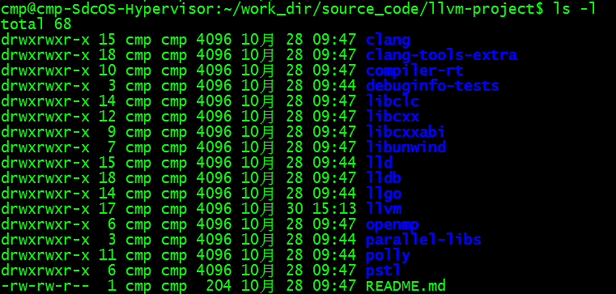
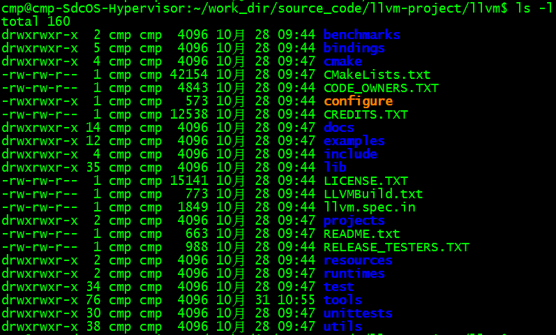

# Directory Layout

Source-code of llvm-project clone with git:https://github.com/llvm/llvm-project.git

HEAD detached at llvmorg-9.0.0

After the source-code is downloaded, a directory named 'llvm-project' appears and the directory listing is as follows:



The following is a brief introduction to code layout.

## llvm-project/clang

​	[Clang][ http://clang.llvm.org/ ] is an "llvm native" C/C++/Objective-C compiler, which aims to deliver amazingly fast compiles (e.g. about [3x faster than GCC][http://clang.llvm.org/features.html#performance] when compiling Objective-C code in a debug configuration), extremely useful [error and warning messages][http://clang.llvm.org/diagnostics.html] and to provide a platform for building great source level tools. The [Clang Static Analyzer][http://clang-analyzer.llvm.org/] is a tool that automatically finds bugs in your code, and is great example of the sort of tool that can be built using the Clang frontend as library to parse C/C++ code.

## llvm-project/clang-tools-extra

​	This repository holds tools that are developed as a part of the LLVM compiler infrastructure project and the Clang frontend. The tools are kept in a seperate "extra" repository to allow lighter weight checkouts of the core Clang codebase.

​	This repository is only intended to be checked out inside of a full LLVM+Clang tree, and in the 'tool/extra' subdirectory of the Clang checkout.

​	All discussing regarding Clang, Clang-based tools, and code in this repository should be held using the standard Clang mailing lists:	http://lists.llvm.org/mailman/listinfo/cfe-dev

## llvm-project/compiler-rt

​	The [compiler-rt][http://compiler-rt.llvm.org/] project provides highly tuned implementations of the low-level code generator support routines like "__fixunsdfdi" and other calls generated when a target doesn't have a short sequence of native instructions to implement a core IR operation. It also provides implementations of run-time libraries for dynamic testing tools such as [AdressSanitizer][http://clang.llvm.org/docs/AddressSanitizer.html], [ThreadSanitizer][http://clang.llvm.org/docs/ThreadSanitizer.html], [MemorySanitizer][http://clang.llvm.org/docs/MemorySanitizer.html], and [DataFlowSanitizer][http://clang.llvm.org/docs/DataFlowSanitizer.html]

## llvm-project/debuginfo-tests

​	This is a collection of tests to check debugging information generated by compiler. This test suite can be checked out inside clang/test folder. This will enable 'make test' for clang to pick up these tests. Typically, test cases included here includes debugger commands and intended debugger output as comments in source file using DEBUGGER: and CHECK: as prefixes respectively:

​	For example:

```asm
define i32 @f1(i32 %i) nounwing ssp{
	; DEBUGGER: break f1
	; DEBUGGER: r
	; DEBUGGER: p i
	; CHECK: $1 = 42
	entry:
}
```

 is a testcase where the debugger is asked to break at function 'f1' and print value of argument 'i'. The expected value of 'i' is 42 in this case.

## llvm-project/libclc

​	The [libclc][http://libclc.llvm.org/] project aim to implement the OpenCL standard library.

## llvm-project/libcxx & llvm-project/libcxxabi

​	The [libc++][http://libcxx.llvm.org/] and [libc++ ABI][http://libcxxabi.llvm.org/] projects provide a standard conformant and high-performance implementation of the C++ standard library, include full support for C++ 11 and C++ 14.

## llvm-project/libunwind

​	libunwind is an implementation of the interface defined by the HP libunwind project. It was contributed by Apple as a way to enable clang++ to port to platforms that do not have a system unwinder. It is intended to be a small and fast  implementation of  the ABI, leaving off some features of HP's libunwind that never materialized(e.g. remote unwinding).

## llvm-project/lld

​	The [LLD][http://lld.llvm.org/] project is a new linker. That is a drop-in replacement of system linkers and runs much faster.

## llvm-project/lldb

​	The [LLDB][http://lldb.llvm.org/] project builds on libraries provided by LLVM and Clang to provide a great native debugger. It uses the Clang ASTs and expression parser, LLVM JIT, LLVM disassembler, etc  so that it provides an experience that "just works". It is also blazing fast and much more memory efficient than GDB at loading symbols.

## llvm-project/llgo

​	llgo is a Go(http://golang.org) frontend for llvm, written in Go.

​	llgo is under active development. It compiles and passes most of the standard library test suited and a substantial portion of the gc test suits, but there are some corner cases that are known not to be handled correctly yet. Nevertheless it can compile modestly substantial programs (including itself; it is self hosting on x86-64 Linux).

## llvm-project/openmp

​	The [OpenMP][http://openmp.llvm.org/] subproject provides an OpenMP runtime for use with the OpenMP implementation in Clang.

## llvm-project/parallel-libs

​	The LLVM open source project will contain a subproject named parallel-libs which will host the development of libraries which are aimed at enabling parallelism in code and which are also closely tied to compiler tied to compiler technology. Examples of libraries suitable for hosting within the parallel-libs subproject are runtime libraries and parallel math libraries. The initial candidates for inclusion in this subproject are **Stream Executor** and **libomptarget** which would live in the streamexecutor and libomptarget subdirectories of parallel-libs, respectively.

## llvm-project/polly

​	The [polly][http://polly.llvm.org/] project implements a suite of cache-locality optimizations as well as auto-parallelism and vectorization using a polyhedral model.

## llvm-project/pstl

​	Parallel STL is an implementation of the C++ standard library algorithms with support for execution policies, as specified in ISO/IEC 14882:2017 standard, commonly called C++17. The implementation also supports the unsequenced execution policy specified in Parallelism TS version 2 and proposed for the next version of C++ standard in the C++ working group paper [P1001](https://wg21.link/p1001).

​	Parallel STL offers efficient support for both parallel and vectorized execution of algorithm. For sequential execution, it relies on an available implementation of the C++ standard library.

## llvm-project/llvm

​	This directory and its subdirectories contain source code for LLVM, a toolkit for the construction of highly optimized compilers, optimizers, and runtime environments.

​	LLVM is open source software. You may freely distribute it under the terms of the license agreement found in LICENSE.txt.	

​	Please see the documentation provided in docs/ for further assistance with LLVM, and in particular docs/GettingStarted.rst for getting started with LLVM and docs/README.txt for and overview of LLVM's documentation setup.


## llvm directory layout

llvm-project/llvm directory listing is as follows:



### llvm-project/llvm/benchmarks/

​	benchmarks test. It supports for registering benchmarks for functions.

### llvm-project/llvm/bindings/

​	This directory contains bindings for the LLVM compiler infrastructure to allow programs written in languages other than C or C++ to take advantage of the LLVM infrastructure -- for instance, a self-hosted compiler frontend.

### llvm-project/llvm/cmake/

​	This directory contains cmake-project files which are used to build LLVM.

### llvm-project/llvm/CODE_OWNERS.TXT

​	This file is a list of the people responsible for ensuring that patches for a particular part of LLVM are reviewed, either by themself or by someone else. They are also the gatekeepers for their part of LLVM, with the final word on what goes in or not.

### llvm-project/llvm/configure

​	The LLVM project no longer supports building with configure & make.Please migrate to the CMake-based build system.

### llvm-project/llvm/CREDITS.TXT

​	This file is a partial list of people who have contributed to the LLVM project. If you have contributed a patch or made some other contribution to LLVM, please submit a patch to this file to add yourself, and it will be done!

### llvm-project/llvm/docs/

​	Documentions of LLVM project.

### llvm-project/llvm/examples/

​	Simple examples using the LLVM IR and JIT.

### llvm-project/llvm/include/

​	Public header files exported from the LLVM library. The three main subdirectories:

#### llvm/include/llvm/

​	All LLVM-specific header files, and subdirectories for different portions of LLVM: Analysis, CodeGen, Target, Transforms, etc...

#### llvm/include/llvm/Support/

​	Generic support libraries provided with LLVM but not necessarily specific to LLVM. For example, some C++ STL utilities and a Command Line option processing library store header files here.

#### llvm/include/llvm/Config/

​	Header files configured by cmake. They wrap "standard" UNIX and C header files. Source code can include these header files which automatically take care of the conditional #includes that cmake generates.

### llvm-project/llvm/lib/

​	Most source files are here. By putting code in libraries, LLVM makes it easy to share code among the tools.

#### llvm/lib/IR/

​	Core LLVM source files that implement core classes like Instruction and BasicBlock.

#### llvm/lib/AsmParser/

​	Source code for the LLVM assembly language parser library

#### llvm/lib/Bitcode/

​	Code for reading and writing bitcode.

#### llvm/lib/Analysis/

​	A variety of program analyses, such as Call Graphs, Induction Variables, Natural Loop Identification, etc.

#### llvm/lib/Transforms/

​	IR-to-IR program transformations, such as Aggressive Dead Code Elimination, Sparse Conditional Constant Propagation, inlining, Loop Invariant Code Motion, Dead Global Elimination, and many others.

#### llvm/lib/Target/

​	Files describing target architectures for code generation. For example, llvm/lib/Target/X86 holds the X86 machine description.

#### llvm/lib/CodeGen/

​	The major parts of the code generator: Instruction Selector, Instruction Scheduling, and Register Allocation.

#### llvm/lib/MC/

​	(FIXME: T.B.D.)....?

#### llvm/lib/ExecutionEngine/

​	Libraries for directly executing bitcode at runtime in interpreted and JIT-compiled scenarios.

#### llvm/lib/Support/

​	Source code that corresponding to the header files in llvm/include/ADT/ and llvm/include/Support/.

### llvm-project/llvm/LLVMBuild.txt

​	This is an LLVMBuild description file for the components in this subdirectory.For more information on the LLVMBuild system, please see:http://llvm.org/docs/LLVMBuild.html

### llvm-project/llvm/llvm.spec.in

​	Special configure file for LLVM project.

### llvm-project/llvm/projects/

​	Projects not strictly part of LLVM but shipped with LLVM. This is also the directory for creating your own LLVM-based projects which leverage the LLVM build system.

### llvm-project/llvm/README.txt

​	A text file that introduces and explains for LLVM project.

### llvm-project/llvm/RELEASE_TESTERS.TXT

​	This file is a list of the people responsible for ensuring that targets and environments get tested and validated during the release process.

### llvm-project/llvm/runtimes/

​	runtimes are sub-projects of LVM. They are different from tools or other drop-in projects because runtimes should be built with the LLVM toolchain from the build directory.

### llvm-project/llvm/test/

​	Feature and regression tests and other sanity checks on LLVM infrastructure. These are intended to run quickly and cover a lot of territory without being exhaustive.

### llvm-project/llvm/tools/

​	Executables built out of the libraries above, which form the main part of the user interface. You can always get help for a tool by typing tool_name -help. There are the most important tools:

###### bugpoint:

​	bugpoint is used to debug optimization passes or code generation backends by narrowing down the given test case to the minimum number of passes and/or instructions that still cause a problem, whether it is a crash or miscompilation. See How ToSubmitABug.html for more information on using bugpoint.

###### llvm-ar:

​	The archiver produces an archive containing the given LLVM bitcode files, optionally with an index for faster lookup.

###### llvm-as:

​	The assembler transforms the human readable LLVM assembly to LLVM bitcode.

###### llvm-dis:

​	The disassembler transforms the LLVM bitcode to human readable LLVM assembly.

###### llvm-link:

​	llvm-link, not surprisingly, links multiple LLVM modules into a single program.

###### lli:

​	lli is the LLVM interpreter, which can directly execute LLVM bitcode(although very slowly...). For architectures that support it (currently X86, Sparc, and PowerPC), by default, lli will function as a Just-In-Time compiler(if the functionality was compiled in), and will execute the code much faster than the interpreter.

###### llc:

​	llc is the LLVM backend compiler, which translates LLVM bitcode to a native code assembly file.

###### opt:

​	opt reads LLVM bitcode, applies a series of LLVM to LLVM transformations (which are specified on the command line), and outputs the resultant bitcode. 'opt -help' is a good way to get a list of the program transformations available in LLVM.

​	opt can also run a specific analysis on an input LLVM bitcode file and print the results. Primarily useful for debugging analyses, or familiarizing yourself with what an analysis does.

### llvm-project/llvm/unittests/

​	unittests are written using [Google test][https://github.com/google/googletest/blob/master/googletest/docs/primer.md] and [Google Mock][https://github.com/google/googletest/blob/master/googlemock/docs/ForDummies.md] .

### llvm-project/llvm/utils/

​	Utilities for working with LLVM source code; some are part of the build process because they are code generators for parts of the infrastructure.

###### codegen-diff:

​	codegen-diff finds differences between code that LLC generates and code that LLI generates. This is useful if you are debugging one of them, assuming that the other generates correct output. For the full user manual, run 'perldoc codegen-diff'.

###### emacs:

​	Emacs and XEmacs syntax highlighting for LLVM assembly files and TableGen description files. See the README for information on using them.

###### getsrcs.sh:

​	Finds and outputs all non-generated source files, useful if one wishes to do a lot of development across directories and does not want to find each file. One way to use it is to run, for example: xemacs `utils/getsources.sh` from the top of the LLVM source tree.

###### llvmgrep:

​	Performs an egrep -H -n on each source file in LLVM and passes to it a regular expression provided on llvmgrep's command line. This is an efficient way of searching the source base for a particular regular expression.

###### TableGen:

​	Contains the tool used to generate register descriptions, instruction set descriptions, and even assemblers from common TableGen description files.

###### vim/:

​	Vim syntax-highlighting for LLVM assembly files and TableGen description files. See the README for how to use them.