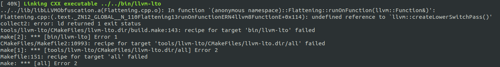

# How to solve 'undefined reference to llvm::createLowerSwitchPass()' when compiling Obfuscator(llvm-9.0) ?

How to solve the problem that an error occurs in Obfuscator(llvm-9.0) compilation, as follow figure:



​	As error information showing, 'undefined reference to llvm::createLowerSwitchPass()'. Cause of the problem is lack of llvm link-components configured.

​	The way to solve the problem is:

​	1.modify 'obfuscator/tools/lto/CMakeLists.txt':

```cmake
1 set(LLVM_LINK_COMPONENTS                         2 +++  Obfuscation # --[FIX err]
3 +++  TransformUtils # --[FIX err]
4   AllTargetsAsmParsers
5   AllTargetsCodeGens

```

​	2.modify 'obfuscator/tools/llvm-lto/CMakeLists.txt'

```cmake
1 set(LLVM_LINK_COMPONENTS                         2 +++  Obfuscation # --[FIX err]
3 +++  TransformUtils # --[FIX err]
4   AllTargetsAsmParsers
5   AllTargetsCodeGens
```

​	3.modify 'obfuscator/tools/llvm-lto2/CMakeLists.txt'

```cmake
1 set(LLVM_LINK_COMPONENTS                         2 +++  Obfuscation # --[FIX err]
3 +++  TransformUtils # --[FIX err]
4   AllTargetsAsmParsers
5   AllTargetsCodeGens
```


​	4.modify 'obfuscator/unittests/IR/CMakeLists.txt'

```cmake
1 set(LLVM_LINK_COMPONENTS                                           2 +++  Obfuscation # --[FIX err]
3 +++  TransformUtils # --[FIX err]
4   Analysis
5   AsmParser
```


​	5.modify 'obfuscator/unittests/Passes/CMakeLists.txt'

```cmake
10 set(LLVM_LINK_COMPONENTS                                           11 +++     Obfuscation # --[FIX err]
12 +++     TransformUtils # --[FIX err]
13         Support                                                   14         Passes                                                     15         Core)
```

​	6.Finally, create obfuscator cmake project, and make.

## Note:

The way above is too complex. I think that there is a better way to solve this problem, maybe modifying other cmake-config to compile the function definition(llvm::createLowerSwitchPass) into other archive, or others. At the moment, I have not idea.

If your way is better than mine, please tell me. Thanks.

mailbox:18428388868@163.com

