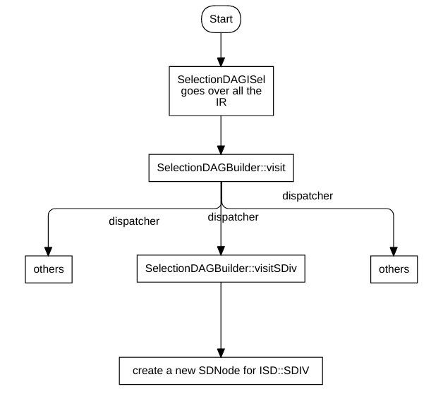
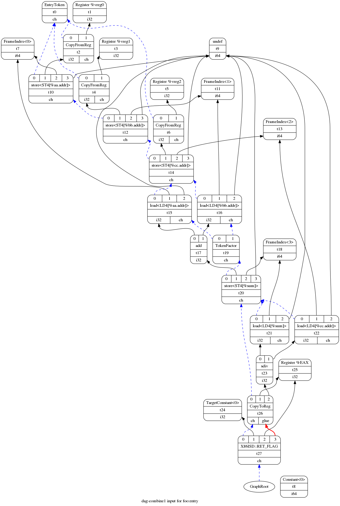
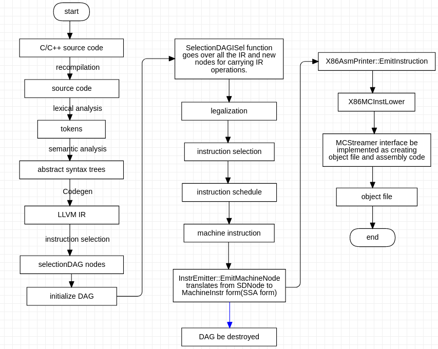

# Look into the mechanism translating from source-code to machine-code in llvm

What I aim to do here is follow the various incarnations an "instruction" takes when it goes through LLVM's multiple compilation stages, starting from a syntactic construct in the source language and until being encoded as binary machine code in an ouput object file.

This article in itself will not teach one how LLVM works. It assumes some existing familiarity with LLVM's design and code base, and leaves a lot of "obvious" detail out. Note that unless otherwise stated, the information here is relevant to LLVM9.0. LLVM and Clang are fast-moving projects, and future changes may render parts of this article incorrect. If you notice any discrepancies, please let me know and I'll do my best to fix them.

## Input code

I want to start this exploration process at the beginning - C  source. Here's the simple function we're going to work with:

```C
int foo(int aa, int bb, int cc){
	int sum = aa + bb;
	return sum / cc;
}
```

The focus of this article is going to be on the division operation.

## Clang

Clang serves as the frontend for LLVM, responsible for converting C, C++ and ObjC source in LLVM IR. Clang's main complexity comes from the ability to correctly parse and semantically analyze C++; The flow from a simple C-level operation is actually quite straightforward.

Clang's parser builds an Abstract Syntax Tree (AST) out of the input. The AST is the main "currency" in which various parts of Clang deal. For our division operation, a `BinaryOperator` node is created in the AST, carrying the `BO_div` "operator kind".

Use Clang to print AST:

```shell
$ ./clang -cc1 /tmp/1.c -ast-dump
```

Result:

```
TranslationUnitDecl 0x5619c4e968d8 <<invalid sloc>> <invalid sloc>
|-TypedefDecl 0x5619c4e97170 <<invalid sloc>> <invalid sloc> implicit __int128_t '__int128'
| `-BuiltinType 0x5619c4e96e70 '__int128'
|-TypedefDecl 0x5619c4e971e0 <<invalid sloc>> <invalid sloc> implicit __uint128_t 'unsigned __int128'
| `-BuiltinType 0x5619c4e96e90 'unsigned __int128'
|-TypedefDecl 0x5619c4e974c8 <<invalid sloc>> <invalid sloc> implicit __NSConstantString 'struct __NSConstantString_tag'
| `-RecordType 0x5619c4e972c0 'struct __NSConstantString_tag'
|   `-Record 0x5619c4e97238 '__NSConstantString_tag'
|-TypedefDecl 0x5619c4e97560 <<invalid sloc>> <invalid sloc> implicit __builtin_ms_va_list 'char *'
| `-PointerType 0x5619c4e97520 'char *'
|   `-BuiltinType 0x5619c4e96970 'char'
|-TypedefDecl 0x5619c4e97838 <<invalid sloc>> <invalid sloc> implicit __builtin_va_list 'struct __va_list_tag [1]'
| `-ConstantArrayType 0x5619c4e977e0 'struct __va_list_tag [1]' 1 
|   `-RecordType 0x5619c4e97640 'struct __va_list_tag'
|     `-Record 0x5619c4e975b8 '__va_list_tag'
`-FunctionDecl 0x5619c4ef4cd0 </tmp/1.c:1:1, line:4:1> line:1:5 foo 'int (int, int, int)'
  |-ParmVarDecl 0x5619c4ef4ae0 <col:9, col:13> col:13 used aa 'int'
  |-ParmVarDecl 0x5619c4ef4b60 <col:17, col:21> col:21 used bb 'int'
  |-ParmVarDecl 0x5619c4ef4be0 <col:25, col:29> col:29 used cc 'int'
  `-CompoundStmt 0x5619c4ef4f98 <col:33, line:4:1>
    |-DeclStmt 0x5619c4ef4ee0 <line:2:3, col:20>
    | `-VarDecl 0x5619c4ef4de8 <col:3, col:18> col:7 used sum 'int' cinit
    |   `-BinaryOperator 0x5619c4ef4ec0 <col:13, col:18> 'int' '+'
    |     |-ImplicitCastExpr 0x5619c4ef4e90 <col:13> 'int' <LValueToRValue>
    |     | `-DeclRefExpr 0x5619c4ef4e50 <col:13> 'int' lvalue ParmVar 0x5619c4ef4ae0 'aa' 'int'
    |     `-ImplicitCastExpr 0x5619c4ef4ea8 <col:18> 'int' <LValueToRValue>
    |       `-DeclRefExpr 0x5619c4ef4e70 <col:18> 'int' lvalue ParmVar 0x5619c4ef4b60 'bb' 'int'
    `-ReturnStmt 0x5619c4ef4f88 <line:3:3, col:16>
      `-BinaryOperator 0x5619c4ef4f68 <col:10, col:16> 'int' '/'
        |-ImplicitCastExpr 0x5619c4ef4f38 <col:10> 'int' <LValueToRValue>
        | `-DeclRefExpr 0x5619c4ef4ef8 <col:10> 'int' lvalue Var 0x5619c4ef4de8 'sum' 'int'
        `-ImplicitCastExpr 0x5619c4ef4f50 <col:16> 'int' <LValueToRValue>
          `-DeclRefExpr 0x5619c4ef4f18 <col:16> 'int' lvalue ParmVar 0x5619c4ef4be0 'cc' 'int'
```

Clang's code generator then goes on to emit a `sdiv` LLVM IR instruction from the node, since this is a division of signed integeral types.

## LLVM IR

To get the LLVM IR:

```shell
$ ./clang -S -emit-llvm /tmp/1.c -o -
```

Here is the LLVM IR created for the function:

```
; ModuleID = '/tmp/1.c'
source_filename = "/tmp/1.c"
target datalayout = "e-m:e-i64:64-f80:128-n8:16:32:64-S128"
target triple = "x86_64-unknown-linux-gnu"

; Function Attrs: noinline nounwind optnone uwtable
define dso_local i32 @foo(i32 %aa, i32 %bb, i32 %cc) #0 {
entry:
  %aa.addr = alloca i32, align 4
  %bb.addr = alloca i32, align 4
  %cc.addr = alloca i32, align 4
  %sum = alloca i32, align 4
  store i32 %aa, i32* %aa.addr, align 4
  store i32 %bb, i32* %bb.addr, align 4
  store i32 %cc, i32* %cc.addr, align 4
  %0 = load i32, i32* %aa.addr, align 4
  %1 = load i32, i32* %bb.addr, align 4
  %add = add nsw i32 %0, %1
  store i32 %add, i32* %sum, align 4
  %2 = load i32, i32* %sum, align 4
  %3 = load i32, i32* %cc.addr, align 4
  %div = sdiv i32 %2, %3
  ret i32 %div
}

attributes #0 = { noinline nounwind optnone uwtable "correctly-rounded-divide-sqrt-fp-math"="false" "disable-tail-calls"="false" "less-precise-fpmad"="false" "min-legal-vector-width"="0" "no-frame-pointer-elim"="true" "no-frame-pointer-elim-non-leaf" "no-infs-fp-math"="false" "no-jump-tables"="false" "no-nans-fp-math"="false" "no-signed-zeros-fp-math"="false" "no-trapping-math"="false" "stack-protector-buffer-size"="8" "target-cpu"="x86-64" "target-features"="+cx8,+fxsr,+mmx,+sse,+sse2,+x87" "unsafe-fp-math"="false" "use-soft-float"="false" }

!llvm.module.flags = !{!0}
!llvm.ident = !{!1}

!0 = !{i32 1, !"wchar_size", i32 4}
!1 = !{!"clang version 9.0.0 (https://github.com/llvm/llvm-project.git 0399d5a9682b3cef71c653373e38890c63c4c365)"}
```

In LLVM IR, `sdiv` is a `BinaryOperator`, which is a subclass of [Instruction](https://llvm.org/doxygen/classllvm_1_1Instruction.html) with the opcode `SDiv`(defined in llvm/IR/Instruction.def). Like any other instruction, it can be processed by the LLVM analysis and transformation passes. For a specific example targeted at `SDiv`, take a look at `SimplifySDivInst`(in file llvm/lib/Analysis/InstructionSimplify.cpp). Since all through the LLVM "middle-end" layer the instruction remains in its IR form, I won't spend much time talking about it. To witness its next incarnation, we'll have to look at the LLVM code generator.

The code generator is one of the most complex parts of LLVM. Its task is to "lower" the relatively high-level, target-independent LLVM IR into low-level, target-dependent "machine instructions"(MachineInstr). On its way to a `MachineInstr`, an LLVM IR instruction passes through a "selection DAG node" incarnation, which is what I'm going to discuss next.

## Selection DAG node

Selection DAG nodes are created by the `SelectionDAGBuilder`(defined in file llvm/lib/CodeGen/SelectionDAG/ls SelectionDAGBuilder.h) class acting "at the service of" `SelectionDAGISel`(defined in file llvm/include/llvm/CodeGen/SelectionDAGISel.h ), which is the main base class for instruction selection. `SelectionDAGISel` goes over all the IR instructions and calls the `SelectionDAGBuilder::visit` dispatcher on them. The method handling a `SDiv` instruction is `SelectionDAGBuilder::visitSDiv`. It requests a new `SDNode` from the DAG with the opcode `ISD::SDIV`, which becomes a node in the DAG.



The initial DAG constructed this way is still only partially target dependent. In LLVM nomenclature it's called "illegal" - the types it contains may not be directly supported by the target; the same is true for the operations it contains.

There are a couple of ways to visualize the DAG. One is to pass the `-debug` flag to llc, which will cause it to create a textual dump of the DAG during all the selection phases. Another is to pass one of the `-view` options which causes it to dump and display an actual image of the graph(more detail in the [code generator docs](http://llvm.org/docs/CodeGenerator.html)). Here's the relevant porition of the DAG showing our `SDiv` node, right after DAG creation(the `sdiv` node is in the bottom):

1. Before creating DAG graph, you must install a few of component:

   ```
   #!/bin/bash
   sudo apt-get install -y graphviz
   sudo apt-get install -y graphviz-dev graphviz-doc libgraphviz-dev
   which dot
   if [ $? -eq 0 ];then
   	echo "SUCC"
   else
   	echo "FAILED"
   	exit 1
   fi
   ```

2. Using Clang to create LLVM IR with the file /tmp/1.c which mentioned as above. 

   ```shell
   BIN_DIR=~/work_dir/source_code/llvm-project-3.9_build/bin
   ${BIN_DIR}/clang -S -emit-llvm /tmp/1.c -o /tmp/1.ll
   ${BIN_DIR}/llc -view-dag-combine1-dags /tmp/1.ll
   ```

   Outputs:

   ```
   Writing '/tmp/dag.foo-12591b.dot'...  done. 
   Trying 'xdg-open' program... Remember to erase graph file: /tmp/dag.foo-12591b.dot
   gio: file:///tmp/dag.foo-12591b.dot: No application is registered as handling this file
   ```

   *Note: It does not work to use llc to create dag.XXX.dot file, but llvm3.9*

3. Create DAG graph:

   ```
   dot /tmp/dag.foo-12591b.dot -Tpng -o /tmp/dag1.png
   ```

4. view the DAG graph, as below:

   

The edges of the DAG show the ordering among its operations by a use-def relationship. For example, if a node A has an outgoing edge to node B, meaning node B defines the values that are used in node A. The black arrows represent an inherent ordering between two operations, such as operation and operands. The dashed blue arrows represent chains that exist to enforce a relationship between two un-related nodes. For example, two storing operations should follow the flow of the program in case both access the same memory address. The red edges ensure that two nodes must be executed one after another with no other instructions between. For example, in the above DAG, the `X86ISD::RET_FLAG` node must be executed right after `CopyToReg` node.

Before the SelectionDAG machinery actually emits machine instructions from DAG nodes, these undergo a few other transformations. The most import are the type and operation legalization steps, which use target-specific hooks to convert all operations and types into ones that the target actually supports.

## Legalization in LLVM

Legalization in the phase in code generation that eradicates any instructions that are not supported by the target. There are two legalization phases in LLVM:

-   SelectionDAGs Legalization Types
-   SelectionDAGs Legalize

#### "Legalizing" sdiv into sdivrem on x86

The division instruction(idiv for signed operands) of x86 computes both the quotient and the remainder of the operation, and stores them in two separate registers. Since LLVM's instruction selection distinguishes between such operations (called `ISD::SDIVREM`) and division that only computes the quotient(`ISD::SDIV`), our DAG node will be "legalized" during the DAG legalization phase when the target is x86. Here's how it happens.

An import interface used by the code generator to convey target-specific information to the generally target-independent algorithms is `TargetLowering`. Target implement this interface to describe how LLVM IR instructions should be lowered to legal SelectionDAG operations. The x86 implementation of this interface is `X86TargetLowering`(*Which is arguably the single scariest piece of code in LLVM*). In its constructor it marks which operations need to be "expanded" by operation legalization, and `ISD::SDIV` is one of them. Here's an interesting comment from the code:

```
// Scalar integer divide and remainder are lowered to use operations that produce two results, to match the avaiable instructions. This exposes the two-result form to trivial CSE, which is able to combine x/y and x%y into a single instruction.
```

When `SelectionDAGLegalize::LegalizeOp` sees the Expand flag on a `SDIV` node it replaces it by `ISD::SDIVREM`. This is an interesting example to demonstrate the transformation an operation can undergo while in the selection DAG form.

*Note: `SelectionDAGLegalize::LegalizeOp` is an example of how target-specific information is abstracted to guide the target-independent code generation algorithm.*

## Instruction selection - from SDNode to MachineSDNode

The next step in the code generation process is instruction selection. LLVM provides a generic tablebased instruction selection mechanism that is auto-generated with the help of `TableGen`. Many target backend, however, choose to write custom code in their `SelectionDAGISel::Select` implementations to handle some instructions manually. Other instructions are then sent to the auto-generated selector by calling `SelectCode`.

The x86 backend handles `ISD::SDIVREM` manually in order to take care of some special cases and optimizations. The DAG node created at this step is a `MachineSDNode`, a subclass of `SDNode` which holds the information required to construct an actual machine instruction, but still in DAG node form. At this point the actual x86 instruction opcode is selected - `X86::IDIV32r` in our case.

*Note: The code generator performs DAG optimizations between its major steps, such as between legalization and selection. These optimizations are important and interesting to know about, but since they act on and return selection DAG nodes, they're out of the focus of this article.*

## Scheduling and emitting a MachineInstr

The code we have at this point is still represented as a DAG. But CPUs don't execute DAGs, they execute a linear sequence of instructions. The goal of the scheduling step is to linearize the DAG by assigning an order to its operations(nodes). The simplest approach would be to just sort the DAG topologically, but LLVM's code generator employs clever heuristics(such as register pressure reduction) to try and produce a schedule that would result in faster code.

Each target has some hooks it can implement to affect the way scheduling is done. I won't dwell on this topic here, however.

Finally, the scheduler emits a list of instructions into a `MachineBasicBlock`, using `InstrEmitter::EmitMachineNode` to translate from `SDNode`. The instructions here take the MachineInstr form ("MI form" from now on), and the DAG can be destroyed.

We can examine the machine instructions emitted in this step by calling llc with the `-print-machineinstrs` flag and looking at the first output that says "After instruction selection":

Execute command:

```shell
llc -print-machineinstrs /tmp/1.ll
```

Outputs:

```
# After Instruction Selection:
# Machine code for function foo: Properties: <SSA, tracking liveness, HasVRegs>
Frame Objects:
  fi#0: size=4, align=4, at location [SP+8]
  fi#1: size=4, align=4, at location [SP+8]
  fi#2: size=4, align=4, at location [SP+8]
  fi#3: size=4, align=4, at location [SP+8]
Function Live Ins: %EDI in %vreg0, %ESI in %vreg1, %EDX in %vreg2

BB#0: derived from LLVM BB %entry
    Live Ins: %EDI %ESI %EDX
	%vreg2<def> = COPY %EDX; GR32:%vreg2
	%vreg1<def> = COPY %ESI; GR32:%vreg1
	%vreg0<def> = COPY %EDI; GR32:%vreg0
	MOV32mr <fi#0>, 1, %noreg, 0, %noreg, %vreg0; mem:ST4[%aa.addr] GR32:%vreg0
	MOV32mr <fi#1>, 1, %noreg, 0, %noreg, %vreg1; mem:ST4[%bb.addr] GR32:%vreg1
	MOV32mr <fi#2>, 1, %noreg, 0, %noreg, %vreg2; mem:ST4[%cc.addr] GR32:%vreg2
	%vreg3<def> = MOV32rm <fi#0>, 1, %noreg, 0, %noreg; mem:LD4[%aa.addr] GR32:%vreg3
	%vreg4<def,tied1> = ADD32rm %vreg3<tied0>, <fi#1>, 1, %noreg, 0, %noreg, %EFLAGS<imp-def,dead>; mem:LD4[%bb.addr] GR32:%vreg4,%vreg3
	MOV32mr <fi#3>, 1, %noreg, 0, %noreg, %vreg4; mem:ST4[%sum] GR32:%vreg4
	%EAX<def> = COPY %vreg4; GR32:%vreg4
	CDQ %EAX<imp-def>, %EDX<imp-def>, %EAX<imp-use>
	IDIV32m <fi#2>, 1, %noreg, 0, %noreg, %EAX<imp-def>, %EDX<imp-def,dead>, %EFLAGS<imp-def,dead>, %EAX<imp-use>, %EDX<imp-use>
	%vreg5<def> = COPY %EAX; GR32:%vreg5
	%EAX<def> = COPY %vreg5; GR32:%vreg5
	RET 0, %EAX

# End machine code for function foo.

# After Expand ISel Pseudo-instructions:
# Machine code for function foo: Properties: <SSA, tracking liveness, HasVRegs>
Frame Objects:
  fi#0: size=4, align=4, at location [SP+8]
  fi#1: size=4, align=4, at location [SP+8]
  fi#2: size=4, align=4, at location [SP+8]
  fi#3: size=4, align=4, at location [SP+8]
Function Live Ins: %EDI in %vreg0, %ESI in %vreg1, %EDX in %vreg2
...

```

Note: The output mentions that the code is in SSA form, and we can see that some registers being used are "virtual" registers(e.g. %vreg1).

## Register allocation - from SSA to non-SSA machine instructions

Apart from some well-defined exceptions, the code generated from the instruction selector is in SSA form. In particular, it assumes it has an infinite set of "virtual" registers to act on. This, of course, isn't true. Therefore, the next step of the code generator is to invoke a "register allocator", whose task is to replace virtual by physical registers, from the target's register bank.

The exceptions mentioned above are also important and interesting, so let's talk about them a bit more.

Some instructions in some architectures require fixed register. A good example is our division instruction in x86, which requires its inputs to be in the EDX and EAX registers. The instruction selector knows about these restrictions, so as we can see in the code above, the inputs to `IDIV32r` are physical, not virtual registers. This assignments is done by `X86DAGToDAGSel::Select`.

The register allocator takes care of all the non-fixed registers. There are a few more optimization(and pseudo-instruction expansion) steps that happen on machine instructions in SSA form, but I'm going to skip these. Similarly, I'm not going to discuss the steps performed after register allocation, since these don't change the basic form operations appear in(MachineInstr, at this point). If you're interested, take a look at `TargetPassConfig::addMachinePasses`.

## Emitting code

So we now have our original C function translated to MI form - a MachineFunction filled with instruction objects(MachineInstr). This is the point at which the code generator has finished its job and we can emit the code. In current LLVM, there are two ways to do that. One is the(legacy) JIT which emits executable, ready-to-run code directly into memory. The other is MC, which is an ambitious object-file-and-assembly framework that's been part of LLVM for couple of years, replacing the previous assembly generator. MC is currently being used for assembly and object file emission for all(or at least the important) LLVM targets. MC also enables "MCJIT", which is a JIT-ting framework based on the MC layer, This is why I'm referring to LLVM's JIT module as legacy.

I will first say a few words about the legacy JIT and then turn to MC, which is more universally interesting.

The sequence of passes to JIT-emit code is defined by `LLVMTargetMachine::addPassesToEmitMachineCode`. It calls `addPassesToGenerateCode`, which defines all the passes required to do what most of this article has been talking about until now-turning IR into MI form. Next, it calls `addCodeEmitter`, which is a target-specific pass for converting MIs into actual machine code. Since MIs are already very low-level, it's fairly straightforward to translate them to runnable machine code(When I'm saying "machine code" at this point, I mean actual bytes in a buffer, representing encoded instructions the CPU can run. The JIT directs the CPU to execute code from this buffer once emission is over).

The x86 code for that lives in `lib/Target/X86/X86CodeEmitter.cpp`. For our division instruction there's no special handling here, because the `MachineInstr` it's packaged in already contains its opcode and operands. It is handled generically with other instructions in `emitInstruction`.

## MCInst

When LLVM is used as a static compiler(as part of clang, for instance), MIs are passed down to the MC layer which handles the object-file emission(it can also emit textual assembly files). Much can be said about MC, but that would require an article of its own. A good reference is [this post from the LLVM blog](http://blog.llvm.org/2010/04/intro-to-llvm-mc-project.html). I will keep focusing on the path a single instruction takes. I will keep focusing on the path a single instruction takes.

`LLVMTargetMachine::addPassesToEmitFile` is responsible for defining the sequence of actions required to emit an object file. The actual MI-to-MCInst translation is done in the `EmitInstruction` of the `AsmPrinter` interface. For x86, this method is implemented by `X86AsmPrinter::EmitInstruction`, which delegates the work to the `X86MCInstLower` class. Similarly to the JIT path, there is no special handling for our division instruction at this point, and it's treated generically with other instructions.

By passing `-show-mc-inst` to llc, we can see the MC-level instruction it creates, alongside the actual assembly code:

Executing command:

```shell
llc -show-mc-inst /tmp/1.ll # error: llc: Unknown command line argument '-show-mc-inst'.
```

Outputs:

```
foo:                                    # @foo
# BB#0:                                 # %entry
        movl    %edx, %ecx              # <MCInst #1483 MOV32rr
                                        #  <MCOperand Reg:46>
                                        #  <MCOperand Reg:48>>
        leal    (%rdi,%rsi), %eax       # <MCInst #1096 LEA64_32r
                                        #  <MCOperand Reg:43>
                                        #  <MCOperand Reg:110>
                                        #  <MCOperand Imm:1>
                                        #  <MCOperand Reg:114>
                                        #  <MCOperand Imm:0>
                                        #  <MCOperand Reg:0>>
        cltd                            # <MCInst #352 CDQ>
        idivl   %ecx                    # <MCInst #841 IDIV32r
                                        #  <MCOperand Reg:46>>
        ret                             # <MCInst #2227 RET>
.Ltmp0:
        .size   foo, .Ltmp0-foo
```

The object file(or assembly code) emission is done by implementing the `MCStreamer` interface. Object files are emitted by `MCObjectStreamer`, which is further subclassed according to the actual object file format. For example, ELF emission is implemented in `MCELFStreamer`. The rough path a `MCInst` travels through the streamers is `MCObjectStreamer::EmitInstruction` followed by a format-specific `EmitInstToData`. The final emission of the instruction in binary form is, of cource, target-specific. It's handled by the `MCCodeEmitter` interface(for example `X86MCCodeEmitter`). While in the rest of LLVM code is often tricky because it has to make a separation between target-independent and target-specific capabilities, MC is even more challenging because it adds another dimension - different object file formats. So some code is completely generic, some code is format-dependent, and some code is target-dependent.

## Assemblers and disassemblers

A `MCInst` is deliberately a very simple representation. It tries to shed as much semantic information as possible, keeping only the instruction opcode and list of operands (and a source location for assembler diagnostic). Like LLVM IR, it's an internal representation with multiple possible encodings. The two most obvious are assembly(as shown above) and binary object files.

llvm-mc is a tool that uses the MC framework to implement assemblers and disassemblers. Internally, `MCInst` is the representation used to translate between the binary and textual forms. At this point the tool doesn't care which compiler produced the assembly/object file.

## Overview of compilation process



## Related information:

https://eli.thegreenplace.net/2012/11/24/life-of-an-instruction-in-llvm/#id1