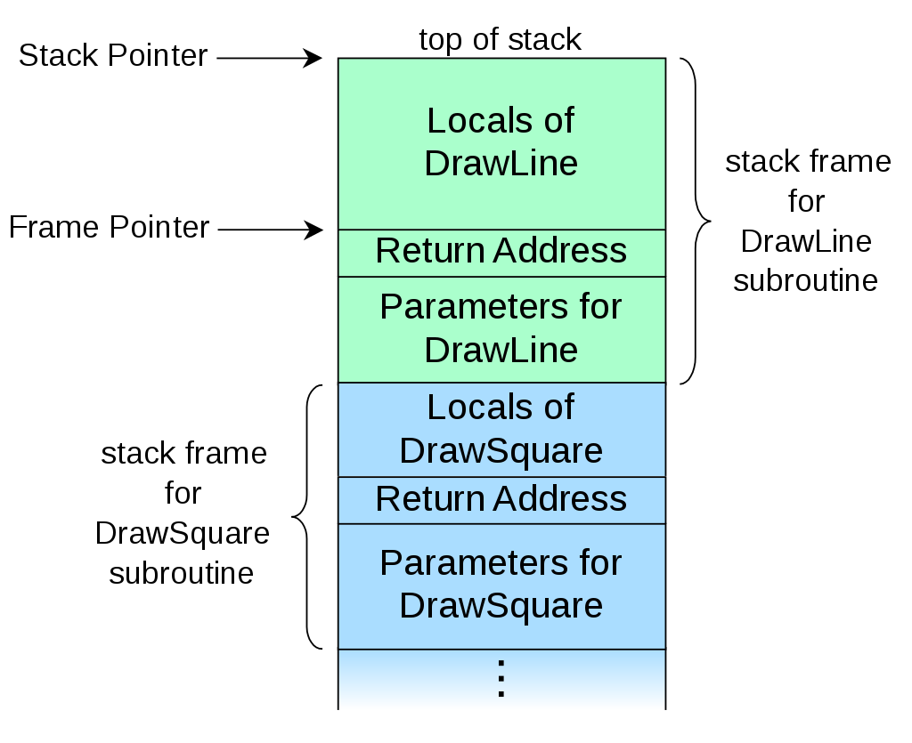

# chapter_01

1. Converting C source-code to LLVM IR with clang:

   ```
   clang -emit-llvm -S test.c -o test.ll
   ```

2. Converting LLVM IR to LLVM bitcode:

   ```shell
   llvm-as test.ll -o test.bc
   ```

   ​	To encode LLVM IR into bitcode, the concept of blocks and records is used. Blocks represent regions of bitstream, for example -- a function body, symbol table, and so on. Each block has an ID specific to its content(for example, function bodies in LLVM IR are represented by ID 12). Records consist of a record code and an integer value, and they describe the entities within the file such as instructions, global variable descriptors, type descriptions, and so on.

   ​	Bitcode files for LLVM IR might be wrapped in a simple wrapper structure. This structure contains a simple header that indicates the offset and size of the embedded BC file.

3. Converting LLVM bitcode to target machine assembly

   ```shell
   llc test.bc -o test.s
   clang -S test.bc -o test.s -fomit-frame-pointer
   ```

   ​	The llc command compiles LLVM bitcode into assembly language for a specified architecture. If we do not mention any architecture as in the preceding command, the assembly will be generated for the host machine where the llc command is being used. By specifying `-march=architecture ` flag in the preceding command, you can specify the target architecture for which the assembly needs to be generated. Using the `-mcpu=cpu ` flag setting, you can specify a CPU within the architecture to generate code. Also by specifying `-regalloc=basic/greedy/fast/pbqp`, you can specify the type of register allocation to be used.

   ​	We use the additional option `-fomit-frame-pointer`, as Clang by default does not eliminate the frame pointer whereas llc eliminates it by default.

   -fomit-frame-pointer

   ​	Omit the frame pointer in functions that don't need one. This avoids the instructions to save, set up and restore the frame pointer; on many targets it also makes an extra register available.

   ​	On some targets this flag has no effect because the standard calling sequence always uses a frame pointer, so it cannot be omitted.

   ​	Note that `-fno-omit-frame-pointer` doesn't guarantee the frame pointer is used in all functions. Several targets always omit the frame pointer in leaf functions.

   Note:

   ​	When stack frame sizes can differ, such as between different functions of between invocations of a particular function, popping a frame off the stack does no constitute a fixed decrement of the stack pointer. At function return, the stack pointer is instead restored to the frame pointer, the value of the stack pointer just before the function was called. Each stack frame contains a stack pointer to the top of the frame immediately below. The stack pointer is a mutable register shared between all invocations. A frame pointer of a give invocation of a function is a copy of the stack pointer as it was before the function was invoked.

   

   ​	The locations of all other fields in the frame can be defined relative either to the top of the frame, as negative offsets to the stack pointer, or relative to the top of the frame below, as positive offsets of the frame pointer. The location of the frame pointer itself must inherently be defined as a negative offset of the stack pointer. For more detail of call-stack , See:https://en.wikipedia.org/wiki/Call_stack

4. Converting LLVM bitcode back to LLVM IR

   ```shell
   llvm-dis test.bc -o test.ll
   ```

5. Transforming LLVM IR

   ```shell
   opt -passname input.ll -o output.ll
   ```

   ​	The `opt` is LLVM optimizer and analyzer tools. When the `-analyze` option is passed to opt, it performs various analyses of the input source and print results usually on the standard output or standard error. Also, the output can be redirected to a file when it is meant to be fed to another program. 

   ​	When the `-analyze` option is not passed to opt, it runs the transformation passes meant to  to optimize the input file. Some of the important transformation, See:http://llvm.org/docs/Passes.html

6. Linking LLVM bitcode

   ```shell
   clang -emit-llvm -S test1.c -o test1.ll
   clang -emit-llvm -S test2.c -o test2.ll
   llvm-as test1.ll -o test1.bc
   llvm-as test2.ll -o test2.bc
   llvm-link test1.bc test2.bc -o output.bc
   ```

   ​	We provide multiple bitcode files to the `llvm-link` tool, which links them together to generate a single bitcode file. Here, output.bc is the generated output file.

   ​	The `llvm-link` works using the basic functionality of a linker -- that is, if a function or variable referenced in one file is defined in the other file, it is the job of linker to resolve all the references made in a file and defined in the other file. But note that this is not the traditional linker that links various object files to generate a binary. The `llvm-link` tool links bitcode files only. After linking the bitcode files, we can generate the output as an IR file by giving `-S` option to the `llvm-link` tool.

7. Executing LLVM bitcode

   ```shell
   lli output.bc
   ```

   `lli` tool takes the input in LLVM bitcode format and executes it using a just-in-time compiler, if there is one available for the architecture, or an interpreter.

8. Using the C frontend Clang

   ```shell
   clang -cc1 test.c -ast-dump
   ```

   ​	Here, the `-cc1` option ensures that only the compiler front-end should be run, not the driver, and it print the AST corresponding to the source code file.

   ```shell
   clang test.c -S -emit-llvm -o -
   ```

   ​	The `-S` and `-emit-llvm` flag ensure the LLVM assembly is generated for the test.c code.

   ​	`-o -` ensure the result to be printed on the standard output.

   ​	To get machine code, pass the `-S` flag alone to clang.

9. Using the GO frontend

   ​	The `llgo` compiler is the LLVM-based frontend for Go written in Go language only. Using this frontend, we can generate the LLVM assembly code from a program written in Go.

   ```shell
   llgo -dump test.go
   ```

   ​	As preceding command, use `llgo` to get the LLVM assembly. For more detail about `llgo`, See: https://github.com/go-llvm/llgo

10. Using DragonEgg

    ​	DragonEgg is gcc plugin that allows gcc to make use of the LLVM optimizer and code generator instead of gcc's own optimizer and code generator.

    ​	You need to have gcc 4.5 or above, with the target machine being x86-32/x86-64 and ARM processor. Also, you need to download the dragonegg source code and build the dragonegg.so file.

    ```shell
    gcc test.c -S -O1 -o - -fplugin=./dragonegg.so
    ```

    See also:http://dragonegg.llvm.org/