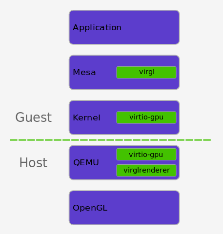

# VM ESCAPE with exploiting CVE-2019-18389

## About CVE-2019-18389

A heap-based buffer overflow in the vrend_renderer_transfer_write_iov function in vrend_renderer.c in virglrenderer through 0.8.0 allows guest OS users to cause a denial of service, or QEMU guest-to-host escape and code execution, via VIRGL_CCMD_RESOURCE_INLINE_WRITE commands.

## virglrenderer 0.8.0

With the release of virglrenderer 0.8.0, getting accelerated OpenGL within a virtual machine (VM) made a big leap forward. Since virglrenderer-0.7.0, the code base has seen ~600 commits, and by providing more than 80% of these contributions, Collabora took the lead in this development cycle.

On the technical side the work has been focusing on more conformance, and performance. One specific aim was to support hosts that support only OpenGL ES to a point that within the VM guest also OpenGL 4.3 applications can be run, an aim that was fully acheived as we can now run games like Alien Isolation (tm) within qemu on certain devices that support only OpenGL ES 3.2 and a number of extension. On the performance side, thanks to the excellent work by done by Alexandros (Collabora), and Gurchetan and Chia-I Wu (Google ChromeOS team) on buffer transfers we can now run many games at a decent speed.

Virglrenderer not only provides the means to provide hardware acceleration to VM guests. With virgl_server and the virgl/vtest mesa driver it offers also a lightweight separation of host hardware and client software that was originally only conceived for testing purposes, but may find applications of its own.

## How does the GPU acceleration work?

Virtualized GPU access is becoming common in the containerized and virtualized application space. Let's have a look at why and how.

For the past few years a clear trend of containerization of applications and services has emerged. Having processes containerized is beneficial in a number of ways. It both improves portability and strengthens security, and if done properly the performance penalty can be low.

In order to further improve security containers are commonly run in virtualized environments. This provides some new challenges in terms of supporting the accelerated graphics usecase.

#### OpenGL ES implementation

Currently Collabora and Google are implementing OpenGL ES 2.0 support. OpenGL ES 2.0 is the lowest common denominator for many mobile platforms and as such is a requirement for Virgil3D to be viable on the those platforms.

That is is the motivation for making Virgil3D work on OpenGL ES hosts.

### 

This stack is commonly referred to as [Virgil3D](https://virgil3d.github.io/), since all of the parts originated from a project with that name.



There are a few parts to this implementation.

QEMU, virglrenderer and virtio-gpu. The way it works is by letting the guest applications speak unmodified OpenGL to the Mesa. But instead of Mesa handing commands over to the hardware it is channeled through virtio-gpu on the guest to QEMU on the host.

QEMU then receives the raw graphics stack state (Gallium state) and interprets it using virglrenderer from the raw state into an OpenGL form, which can be executed as entirely normal OpenGL on the host machine.

The host OpenGL stack does not even have to be Mesa, and could for example be the proprietary nvidia stack.

## How to set up Qemu with virglrenderer

#### Environment

First of all, let's have a look at the development environment. When doing graphical development I find it quite helpful to set up a parallel graphics stack in order to not pollute or depend on the stack of the host machine more than we have to.

```shell
function add_export_env {
  local VAR="$1"
  shift
  local VAL=$(eval echo "\$$VAR")
  if [ "$VAL" ]; then
    VAL=$(concatenate_colon "$@" "$VAL");
  else
    VAL=$(concatenate_colon "$@");
  fi
  eval "export $VAR=\"$VAL\""
}

function prefix_setup {
  local PREFIX="$1"

  add_export_env PATH "$PREFIX/bin"
  add_export_env LD_LIBRARY_PATH "$PREFIX/lib"
  add_export_env PKG_CONFIG_PATH "$PREFIX/lib/pkgconfig/" "$PREFIX/share/pkgconfig/"
  add_export_env MANPATH "$PREFIX/share/man"
  export ACLOCAL_PATH="$PREFIX/share/aclocal"
  mkdir -p "$ACLOCAL_PATH"
  export ACLOCAL="aclocal -I $ACLOCAL_PATH"
}

function projectshell {
  case "$1" in
    virgl | virglrenderer)
        export ALT_LOCAL="/opt/local/virgl"
        mkdir -p "$ALT_LOCAL"
        prefix_setup "$ALT_LOCAL"
        ;;
}
```

The above snippet is something that I would put in my `.bashrc` or `.zshrc`. Don't forget so run `source ~/.bashrc` or the equivalent after making changes.

To enter the environment I simply type `projectshell virgl`.

#### Build libepoxy

libepoxy is a library for managing OpenGL function pointers for you. And it is a dependency of virglrenderer, which we'll get to below.

```shell
git clone https://github.com/anholt/libepoxy.git
cd libepoxy
./autogen.sh --prefix=$ALT_LOCAL
make -j$(nproc --ignore=1)
make install
```

#### Build virglrenderer

Virgilrenderer is the component that QEMU uses to provide accelerated rendering.
It receives Gallium states from the guest kernel via its virtio-gpu interface, which are then translated into OpenGL on the host. It also translates shaders from the TGSI format used by Gallium into the GLSL format used by OpenGL.

```shell
git clone git://anongit.freedesktop.org/virglrenderer
cd virglrenderer
./autogen.sh --prefix=$ALT_LOCAL
make -j$(nproc --ignore=1)
make install
```

#### Build libpciaccess

libpciaccess is a library for simplifying accessing devices on the PCI bus.
It is a dependency of Mesa, which we'll get to below.

```
git clone git://git.freedesktop.org/git/xorg/lib/libpciaccess
cd libpciaccess
./autogen.sh --prefix=$ALT_LOCAL
make -j$(nproc --ignore=1)
make install
```

#### Build Mesa

The Mesa project began as an open-source implementation of the [OpenGL](https://www.opengl.org/) specification - a system for rendering interactive 3D graphics.

Over the years the project has grown to implement more graphics APIs, including [OpenGL ES](https://www.khronos.org/opengles/) (versions 1, 2, 3), [OpenCL](https://www.khronos.org/opencl/), [OpenMAX](https://www.khronos.org/openmax/), [VDPAU](https://en.wikipedia.org/wiki/VDPAU), [VA API](https://en.wikipedia.org/wiki/Video_Acceleration_API), [XvMC](https://en.wikipedia.org/wiki/X-Video_Motion_Compensation) and [Vulkan](https://www.khronos.org/vulkan/).

A variety of device drivers allows the Mesa libraries to be used in many different environments ranging from software emulation to complete hardware acceleration for modern GPUs.

Mesa ties into several other open-source projects: the [Direct Rendering Infrastructure](https://dri.freedesktop.org/) and [X.org](https://x.org/) to provide OpenGL support on Linux, FreeBSD and other operating systems.

Execute the below commands to build Mesa

```shell
# Fetch dependencies
sudo sed -i 's/\#deb-src/deb-src/' /etc/apt/sources.list
sudo apt update
sudo apt-get build-dep mesa

# Actually build Mesa
git clone https://anongit.freedesktop.org/git/mesa/mesa.git
cd mesa
./configure \
    --prefix=$ALT_LOCAL \
    --enable-driglx-direct \
    --enable-gles1 \
    --enable-gles2 \
    --enable-glx-tls \
    --with-egl-platforms='drm x11 wayland' \
    --with-dri-drivers="i915 i965 nouveau" \
    --with-gallium-drivers="nouveau swrast radeonsi"
make -j$(nproc --ignore=1)
make install
```

#### Build QEMU

```shell
git clone git://git.qemu.org/qemu.git
cd qemu
./configure \
    --prefix=$ALT_LOCAL \
    --target-list=x86_64-softmmu \
    --enable-kvm \
    --disable-werror \
    --enable-virglrenderer
make -j$(nproc --ignore=1)
make install
```

### Set up a VM

As a guest we're going to use Ubuntu 17.10, but just use the latest release of whatever distro you like. The kernel *has* have been built with the appropriate virtio-gpu Kconfig options though.

```shell
wget http://releases.ubuntu.com/17.10/ubuntu-17.10.1-server-amd64.iso
qemu-img create -f qcow2 ubuntu.qcow2 35G
qemu-system-x86_64 \
    -enable-kvm -M q35 -smp 2 -m 4G \
    -hda ubuntu.qcow2 \
    -net nic,model=virtio \
    -net user,hostfwd=tcp::2222-:22 \
    -vga virtio \
    -display sdl,gl=on \
    -boot d -cdrom ubuntu-17.10.1-desktop-amd64.iso
```

## QEMU works with virglrenderer 

A general guide on how to set up Qemu with virglrenderer was already posted earlier by Robert Foss. One point to consider is that that games use the mouse in a certain ways that result in erratic mouse behaviour; disabling the emulated PS/2 mouse and using the USB mouse is the way forward. This has the disadvantage that the mouse is grabbed by the Qemu window though, and one has to manually release it (Ctrl-Alt-g).

Now, to run Qemu the following command line was used:

```shell
 qemu-system-x86_64 -enable-kvm  \
     -smp 5 -M q35 -m 8G \
     -drive format=raw,file=ubuntu-19.04.raw,if=virtio \
     -net nic,model=virtio \
     -net user,hostfwd=tcp::2222-:22 \
     -soundhw hda \
     -audiodev id=pa,driver=pa,server= \
     -vga virtio \
     -display sdl,gl=on \
     -fsdev local,id=test_dev,path=$HOME/.local/share/Steam/,security_model=none \
     -device virtio-9p-pci,fsdev=test_dev,mount_tag=test_mount
```

Here ubuntu-19.04.raw contains an Ubuntu 19.04 installation, but with an linux kernel updated to 5.2 because of some bug in the 5.0 kernel. Any recent Linux installation should work though.

The virtio-9p-pci devices are used to mount directories of the host file system as plan9 partitions within the virtual machine, e.g. in order to share the steam library between host and VM. Note that not all games work correctly by doing so. At least **Half Life 2** didn't run properly and had to be download onto the virtual disk.

For the video shown below the virtual machine was executed on a Desktop computer running Gentoo Linux (CPU: AMD FX(tm)-6300, RAM: 32 GB , GPU: Radeon RX 580) with Mesa master @a478e56fbd and virglrenderer @e272472d72. The guest OS Ubuntu 19.04, X-server was configured to run at a a resolution of 1600x900, the same mesa version was used like on the host.


# Related Information

https://www.collabora.com/news-and-blog/blog/2018/02/12/virtualizing-gpu-access/

https://www.collabora.com/news-and-blog/blog/2019/08/28/virglrenderer-state-of-virtualized-virtual-worlds/

https://cve.mitre.org/cgi-bin/cvename.cgi?name=CVE-2019-18389

https://www.mesa3d.org